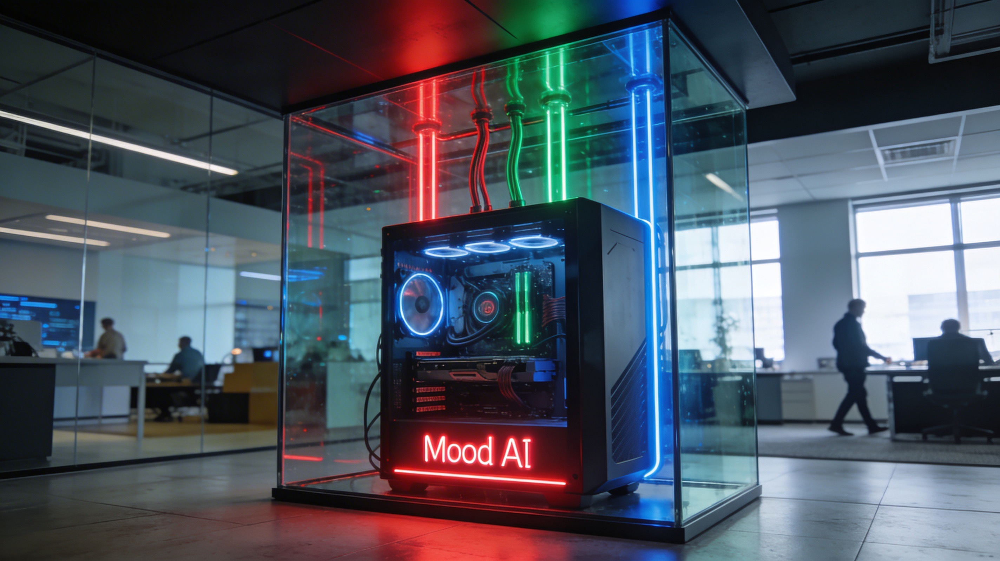

# MoodAI — Multi-Agent Content Platform

AI-drevet innholdsplattform som bruker 4 spesialiserte agenter for å generere markedsføringsinnhold.

**Live demo:** [contentai.petersendc.no](https://contentai.petersendc.no)

---

## Arkitektur

### Content Pipeline: Tekst → Bilde → Video

**Steg 1: Tekst (Aktiv)**
- 4 AI-agenter jobber parallelt med dual-modell (primær + sekundær)
- Agenter: Strateg, Innholdsprodusent, SEO-spesialist, Analyseagent
- 11 AI-leverandører støttet

**Steg 2: Bilde (Planlagt)**
- Kontekst fra tekst → bildegenerering
- Midjourney, Gemini, DALL-E

**Steg 3: Video (Planlagt)**
- Bilde + kontekst → kort video
- Kling AI, Google Veo, Runway

### Agenter

| Agent | Rolle | Anbefalt modell |
|-------|-------|-----------------|
| Strateg | Kanalstrategi og markedsanalyse | Perplexity Sonar Pro |
| Innhold | Innholdsproduksjon tilpasset tone/kanal | Claude Sonnet 4 |
| SEO | Søkeoptimalisering og nøkkelord | Gemini 2.5 Pro |
| Analyse | Evaluering og forbedringsforslag | Claude Opus 4 |

### RAG — Vektordatabase (Proof-of-Concept)
- ChromaDB vektordatabase med API-endepunkt (`/api/rag`)
- Semantisk søk i kundedokumenter
- Python bridge med chunking og embedding

---

## Neste steg: Lokal AI-infrastruktur med RAG

<p align="center">
  
</p>

### Bakgrunn

Dagens MVP bruker sky-baserte AI-leverandører (OpenAI, Anthropic, etc.). For produksjon hos et markedsføringsbyrå trenger vi:

- **Full datakontroll** — kundenes strategier, brandbooks og forretningshemmeligheter forlater aldri bygningen
- **GDPR-kompatibilitet** — ingen tredjepartsprosessering av sensitiv kundedata
- **Forutsigbare kostnader** — ingen API-regninger som skalerer med bruk
- **Lavere responstid** — lokale modeller gir respons på sekunder, ikke avhengig av internett

### Hva er RAG?

**Retrieval-Augmented Generation (RAG)** er en AI-teknikk som kombinerer en språkmodell med ekstern kunnskap fra dokumenter eller databaser for å gi mer nøyaktige og kontekstuelle svar.

**Hvordan det fungerer:**
1. **Indeksering** — Bedriftsdata (PDF, e-post, CRM, brandbooks) konverteres til vektorer (embeddings) og lagres i en vektordatabase
2. **Henting** — Når en bruker spør, søker systemet de mest relevante dokumentene i sanntid
3. **Generering** — Relevant kontekst injiseres i modellens prompt, som genererer svar med kildehenvisninger

**Resultater:**
- Reduserer hallusinasjoner (falsk info) med 70–90 % [[1]](https://aws.amazon.com/what-is/retrieval-augmented-generation/) [[2]](https://www.cgi.com/no/nb/blog/artificial-intelligence/hva-er-retrieval-augmented-generation)
- 60 % færre eskaleringer i kundesupport [[3]](https://oschlo.co/hva-er-rag)
- Data holdes oppdatert uten å retrainere modellen [[4]](https://cloud.google.com/use-cases/retrieval-augmented-generation)
- ROI innen 6–12 måneder gjennom raskere onboarding og færre feil [[5]](https://oschlo.co/rag-implementering-bedrift)

### Foreslått hardware

**[iX600Z AI PC](https://greencom.no/produkt/workstation/ix600z-ai-pc-rtx-6000-pro-96gb-gddr7-ryzen-9-9950x3d-ddr5-128gb) — Dedikert AI-arbeidsstasjon:**

| Komponent | Spesifikasjon | Hvorfor |
|-----------|---------------|---------|
| GPU | NVIDIA RTX 6000 Pro, 96 GB GDDR7 | Kjører 70B-modeller med full kontekst i VRAM |
| CPU | AMD Ryzen 9 9950X3D | 16 kjerner for parallell agent-orkestrering |
| RAM | 128 GB DDR5 | Vektordatabase + flere modeller i minnet samtidig |
| Lagring | NVMe SSD | Rask lasting av modeller og embedding-indekser |

**Hva dette muliggjør:**
- Kjøre Llama 3.1 70B, Qwen 72B, eller Mixtral 8x22B lokalt
- 4 agenter med separate modeller i parallell
- Vektordatabase med millioner av dokumenter i RAM
- Bilde- og videogenerering lokalt (Stable Diffusion, etc.)

### Implementeringsplan

```
Fase 1 — RAG-pipeline (uke 1)
├── Ollama + embedding-modell (nomic-embed-text)
├── ChromaDB med chunking og per-kunde namespaces
├── Dokument-upload: PDF, DOCX, TXT, URL
└── Kunnskapsbase-side i MoodAI

Fase 2 — Agent-integrasjon (uke 2)
├── Agenter henter automatisk kontekst fra RAG
├── Per-kunde isolert data
├── Lokal Ollama som AI-leverandør (ingen API-nøkkel)
└── A/B-testing: lokal vs. sky-modeller

Fase 3 — Workflow-automatisering (uke 3)
├── n8n for visuell workflow-orkestrering
├── Ny kunde → automatisk indeksering av nettside + docs
├── Innhold → auto-publisering via Buffer/SoMe
└── Ukentlig re-indeksering av kundenes nettsider

Fase 4 — Produksjonsklart (uke 4)
├── Dashboard med ekte statistikk og RAG-metrics
├── Kvalitetsmåling: RAG vs. uten RAG
├── Sikkerhet: kryptering, tilgangskontroll, audit-log
└── Dokumentasjon og opplæring
```

### Tech stack (nåværende + planlagt)

| Lag | Nåværende | Planlagt |
|-----|-----------|----------|
| Frontend | Next.js 16, TypeScript, Tailwind v4 | Samme |
| AI-modeller | 11 sky-leverandører + Ollama | Lokale 70B-modeller via Ollama |
| Vektordatabase | ChromaDB (PoC) | ChromaDB/Qdrant med embedding-pipeline |
| Embedding | ChromaDB default | nomic-embed-text / all-MiniLM-L6-v2 |
| Orkestrering | Manuell | n8n workflow-automatisering |
| Infrastruktur | VPS (8 CPU, 32 GB) | Dedikert AI-PC (RTX 6000 Pro, 128 GB) |

### Kilder

1. [What is RAG? — AWS](https://aws.amazon.com/what-is/retrieval-augmented-generation/)
2. [Retrieval-Augmented Generation — CGI Norge](https://www.cgi.com/no/nb/blog/artificial-intelligence/hva-er-retrieval-augmented-generation)
3. [Hva er RAG? — Oschlo](https://oschlo.co/hva-er-rag)
4. [What is RAG? — Google Cloud](https://cloud.google.com/use-cases/retrieval-augmented-generation)
5. [RAG implementering for bedrifter — Oschlo](https://oschlo.co/rag-implementering-bedrift)
6. [RAG kunnskapsbase: Guide for norske bedrifter — Oschlo](https://oschlo.co/rag-kunnskapsbase-komplett-guide-for-norske-bedrifter)
7. [Hva er RAG? — Optimizely](https://www.optimizely.com/no/optimization-glossary/retrieval-augmented-generation-rag/)
8. [RAG — Microsoft Azure](https://azure.microsoft.com/nb-no/resources/cloud-computing-dictionary/what-is-retrieval-augmented-generation-rag)

---

## Kjøring

```bash
npm install
npm run dev     # utvikling
npm run build   # produksjon
```

## Miljøvariabler

```
DEMO_GEMINI_KEY=din-gemini-api-nøkkel  # for demo-modus
```

## Lisens

Proprietær — Petersen Digital Consulting
